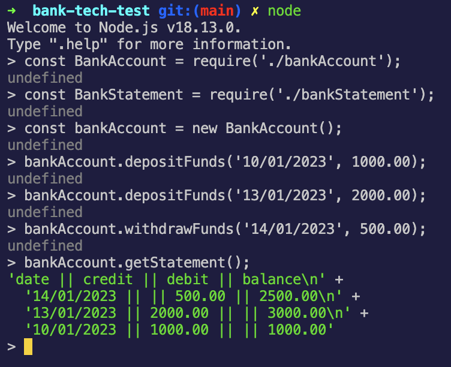
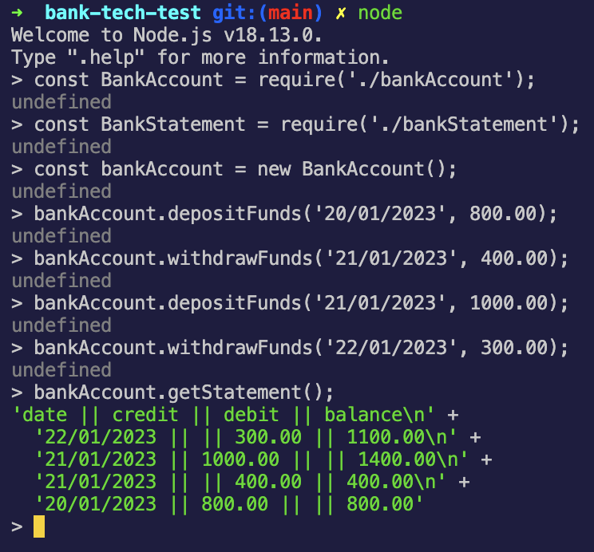
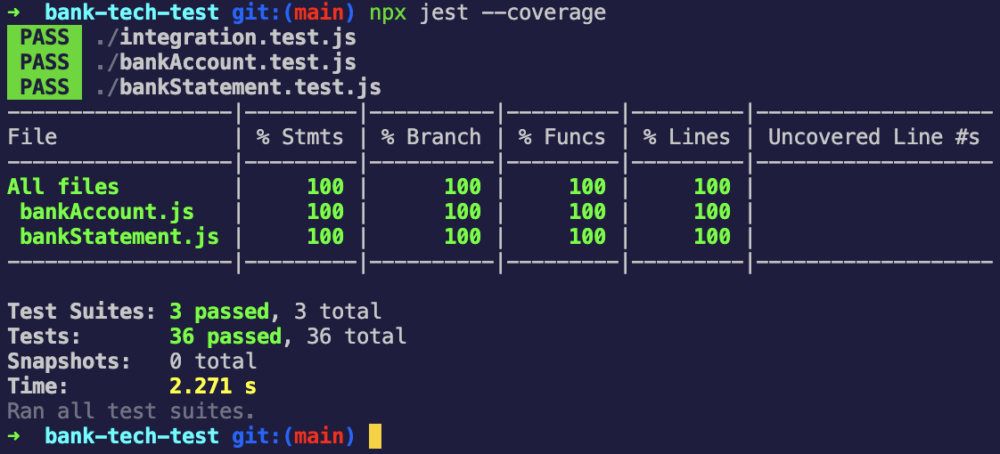

# Bank Tech Test

## About this project
This is a tech-test assignment taken from week 10 of the Makers bootcamp. The program made allows a user to add deposit and withdrawal transactions to a bank account, and print a statement of all transactions from this account. The full specification of this project is outlined below:

### Specification

#### Requirements

- You should be able to interact with your code via a REPL like Node.  (You don't need to implement a command line interface that takes input from STDIN.)
- Deposits, withdrawal.
- Account statement (date, amount, balance) printing.
- Data can be kept in memory (it doesn't need to be stored to a database or anything).

#### Acceptance criteria

**Given** a client makes a deposit of 1000 on 10-01-2023  
**And** a deposit of 2000 on 13-01-2023  
**And** a withdrawal of 500 on 14-01-2023  
**When** she prints her bank statement  
**Then** she would see

```
date || credit || debit || balance
14/01/2023 || || 500.00 || 2500.00
13/01/2023 || 2000.00 || || 3000.00
10/01/2023 || 1000.00 || || 1000.00
```

## Structure and approach
I employed a TDD and OOP approach for this challenge. I initially created one class to deal with all functionality of the program, but later chose to split this into two classes in order to make the code more maintainable, and testing more effective at identifying bugs. The first class, BankAccount, is responsible for handling all transactions (through two functions: depositFunds and WithdrawFunds) and storing transaction data (within this.transactions). The second class, BankStatement, is responsible for formatting transaction data into a bank statement and printing this.

## How to install the code
1. If not already installed: Install Node Version Manager (NVM): ```brew install nvm```
2. If not already installed: Install Node.js (version v19.4.0 at the time of writing): ```nvm install 19```
3. Clone the repository to your device
2. Enter the directory: ```cd bank-tech-test```
3. Activate node: ```nvm use node```
4. Run ```npm install```

## How to run the code
1. Enter the directory: ```cd bank-tech-test```.
2. Run ```node```.
3. Import the BankAccount class: ```const BankAccount = require('./bankAccount')```.
4. Import the BankStatement class: ```const BankStatement = require('./bankStatement')```
5. Create an instance of the BankAccount class, e.g.: ```const account = new BankAccount();```.
6. Run any/all of the three public functions on the BankAccount class instance: depositFunds, withdrawFunds, getStatement (details below):
- depositFunds(date, amountDeposited), e.g.: ```account.depositFunds('01/01/2023', 100.00);```. Please note that: the date must be a string in the format DD/MM/YYYY; you cannot make the transaction date earlier than the preceding transaction date; and amountDeposited must be a positive number.
- withdrawFunds(date, amountWithdrawn), e.g.: ```account.withdrawFunds('02/01/2023', 50.00);```. Again, please note that: the date must be a string in the format DD/MM/YYYY; you cannot make the transaction date earlier than the preceding transaction date; and amountWithdrawn must be a positive number.
- getStatement(), e.g.: ```account.getStatement();``` - this creates a new instance of the BankStatement class, injecting the existing instance of the BankAccount class as a dependency.

## How to run tests on the code
1. Run ```npx jest```.
2. For test coverage, run ```npx jest --coverage```.
Test coverage for the project is 100%.

## Screenshots
#### The program meeting the acceptance criteria in Node


#### A different series of input and output being run in Node


#### All 36 tests passing with 100% coverage

